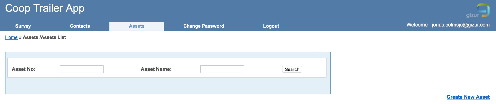
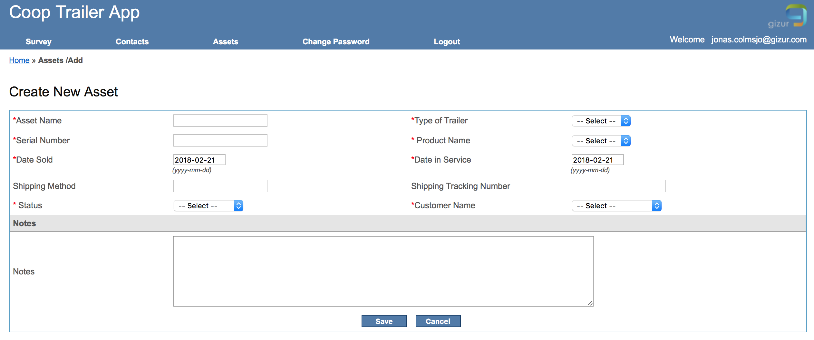
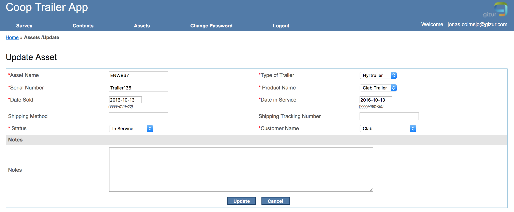

# Assets/Tillgångar (trailers)

För att kunna rapportera besiktningar på en asset/tillgång (trailers) måste dessa först läggas upp.

## Skapa ny asset/tillgång

Välj 'Create New Asset' för att skapa en ny asset/tillgång.

* Fyll i de fält som är markerade med \* 

Se editera asset/tillgång nedan för ett exempel på en asset/tillgång.

## Editera asset/tillgång

Uppdatera de fält som ska ändras och välj sedan 'Update'.
