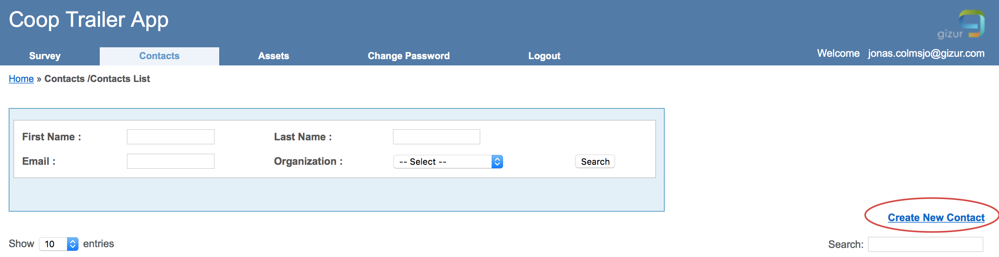

# Contacts/Kontakter (användare/users)

För att kunna logga in i appen krävs login/användarnamn och lösen. Användare hanteras under tabben contacts/kontakter. 

## Skapa ny kontakt/användare

Välj 'Create New Contact' för att skapa en ny användare.

Nya användare:

* Fyll i de fält som är markerade med \* 
* Säkerställ att rätt email-adress matas in
* Kontrollera 'Support End Date'. Efter detta datum kommer användaren inte att kunna logga in längre.
* Om inte transportföretaget är upplagt under Organisation kan 'Clab' väljas istället. Detta används endast för rapporteringsyften.

Ett mail kommer att skickas till den mail-adress som angivtis med ett temporärt lösen som användaren kan ändra.

## Återställ lösen för kontakt/användare

1. Leta upp den kontakt/användare vars lösen ska återställas. Det går att söka på förnamn, efternamn och mail-adress. Det går också att sortera tabellen med användare genom att klicka på en kolumn-rubrik.
1. Välj 'Reset password'
1. Ett mail med ett nytt lösen kommer att mailas till användaren
